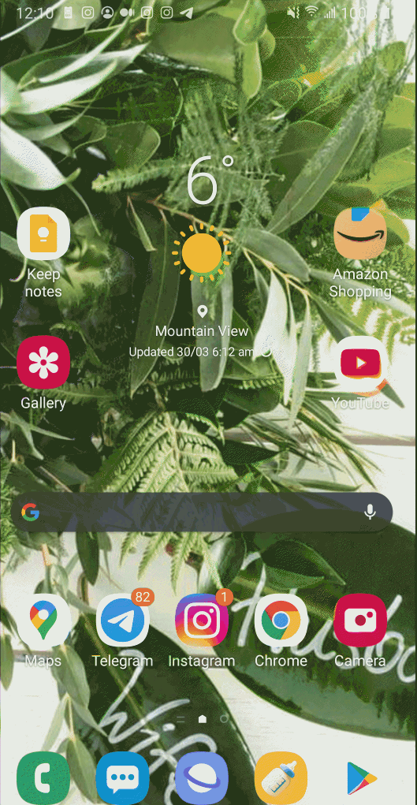

# Currency converter

Simple currency converter with test written by using Espresso library.

## Libraries used in this project
- [Espresso](https://developer.android.com/training/testing/espresso)
- [Junit](https://developer.android.com/training/testing/unit-testing/local-unit-tests.html)
- [Matchers](http://hamcrest.org/JavaHamcrest/javadoc/1.3/org/hamcrest/Matchers.html)
- [ActivityTestRule](https://developer.android.com/reference/androidx/test/rule/ActivityTestRule)

## What I learned
- Build and deploy mobile applications to the real hardware devices and how to use Android Studio IDE. 
-  I learned how to use Activity and View classes
- Use Espresso to write Android UI tests.
- I utilized ArrayLists and HashMaps. 

## Demo app testing

